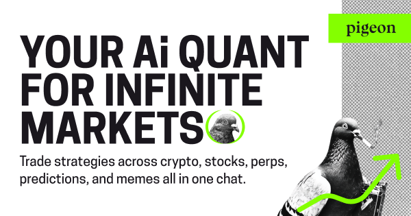

# Pigeon

> The first AI wallet that can talk, code, research, and trade.



Your AI quant for infinite markets—stocks, crypto, perps, and prediction markets. All in one chat.

## Quick Start

### What is Pigeon?
Pigeon is a multi-agent system that pairs world-class AI, automation, and protocols to digest everything onchain so you can navigate easily. Think of it as the "Cursor" or "Replit" moment for trading.

### Supported Markets
- **Crypto**: EVM chains + Solana + TON (spot & limit orders)
- **Traditional**: Stocks, forex, commodities via Ostium  
- **Perpetuals**: Hyperliquid with advanced order types
- **Predictions**: Polymarket event betting
- **Cross-chain**: Seamless asset bridging
- **Pigeon Code**: Autonomous strategy deployment and monitoring

### Platform Access
- [Telegram](https://t.me/pigeon_trade_bot)
- [WhatsApp](https://wa.me/17813300607)
- [Discord](https://discord.com/oauth2/authorize?client_id=1390098020598550559&permissions=1126176932482112&integration_type=0&scope=bot)
- [Messenger](https://www.facebook.com/profile.php?id=61578109435276)
- [Farcaster](https://warpcast.com/pigeontrade)
- [XMTP](https://xmtp.chat/0xC410943B356321a3bBDFBC150D743480BF123370)
- [Base App](https://join.base.app/)
- SMS: +1 888 655 8732

### First Commands
```bash
"What's my portfolio worth?"
"Swap 100 USDC for ETH on Base"
"Long NVDA with 5x leverage"
"Buy $50 YES on Bitcoin hitting $100k"
"Swap 10 TON for USDT"
```

[Get Started →](getting-started.md)
