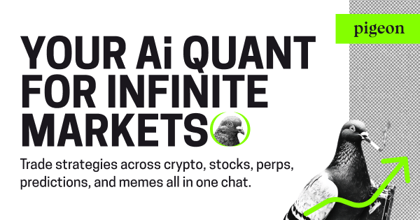

# Pigeon

> Your AI Quant for Infinite Markets



Make money in any market. Trade strategies across crypto, stocks, perps, predictions, and memes all in one chat.

## Quick Start

### What is Pigeon?
Pigeon is your AI quant for infinite markets. Pigeon is a multi-agent system that pairs world-class AI, automation, and protocols that digests everything onchain so users can navigate easily.

### Supported Markets
- **Crypto**: EVM chains + Solana (spot & limit orders)
- **Traditional**: Stocks, forex, commodities via Ostium  
- **Perpetuals**: Hyperliquid with advanced order types
- **Predictions**: Polymarket event betting
- **Cross-chain**: Seamless asset bridging
- **Automation**: Strategy deployment and monitoring

### Platform Access
- [Telegram](https://t.me/pigeon_trade_bot)
- [WhatsApp](https://wa.me/17813300607)
- [Discord](https://discord.com/oauth2/authorize?client_id=1390098020598550559&permissions=1126176932482112&integration_type=0&scope=bot)
- [Messenger](https://www.facebook.com/profile.php?id=61578109435276)
- [Farcaster](https://farcaster.xyz/pigeontrade)
- [XMTP](https://xmtp.chat/0xC410943B356321a3bBDFBC150D743480BF123370)
- [Base App](https://join.base.app/)
- SMS: +1 888 655 8732

### First Commands
```bash
"What's my portfolio worth?"
"Swap 100 USDC for ETH on Base"
"Long NVDA with 5x leverage"
"Buy $50 YES on Bitcoin hitting $100k"
```

[Get Started →](getting-started.md)
